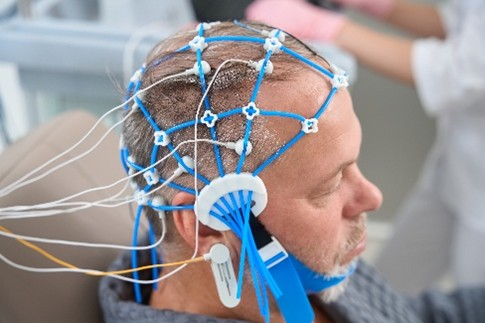

# Electrofisiología cognitiva

## ¿Qué es la electrofisiología cognitiva? 

La electrofisiología cognitiva corresponde al estudio de cómo las funciones cognitivas (percepción, memoria, lenguaje, emociones, etc.) son ejecutadas por la actividad eléctrica producida por una población de neuronas.

## Alguna terminología usada

* **EEG**: Electroencefalograma. Mide actividad eléctrica desde electrodos ubicados en el cuero cabelludo.
```{r, echo=FALSE, out.width='50%', fig.align='center', fig.cap=NULL}

```

* **MEG**: Magnetoencefalografía. Mide los campos magnéticos producidos por la actividad eléctrica en el cerebro a través de un detector de interferencia cuántica superconductora.

* **ECoG**: Electrocorticografía. Mide la actividad eléctrica por medio de electrodos puestos directamente en la corteza cerebral expuesta.
