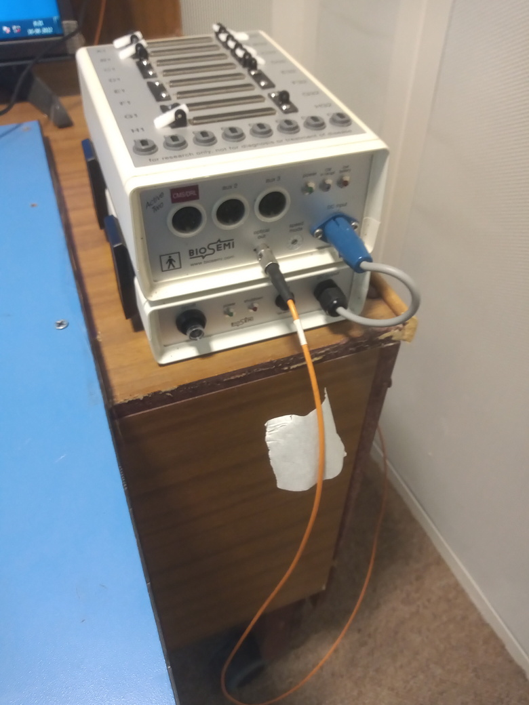
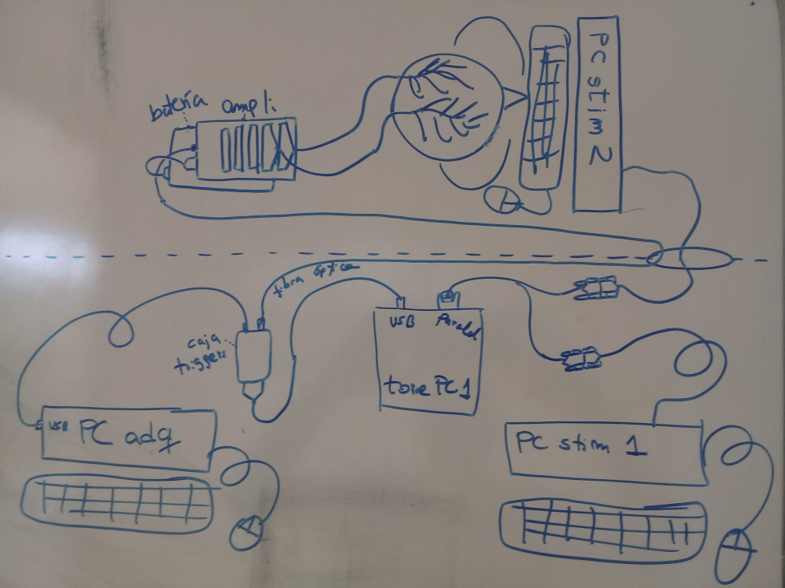
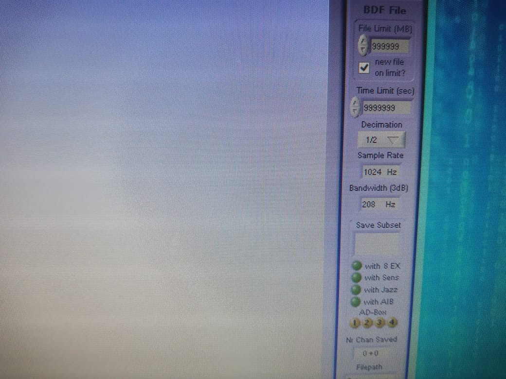
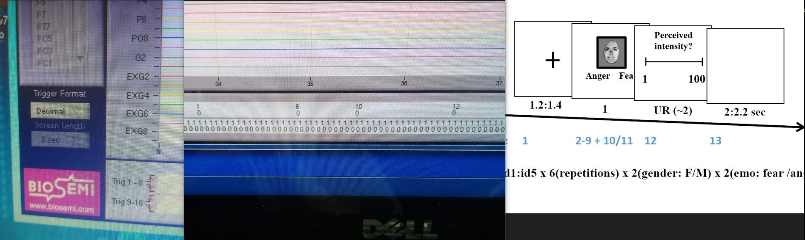

# Práctico EEG - 4

### Día D

**Preparación del laboratorio:**

* Llegar al menos 40 minutos antes
* Abrir ventanas y ventilar la sala
* Encender: PC de adquisición + PC de estimulación

**Material administrativo:**

* Tener consentimientos listos
```{r, echo=FALSE, out.width='50%', fig.align='center', fig.cap=NULL}
knitr::include_graphics('docs/images/papeles.jpg')
```
* Abrir logbook / bitácora
* Definir y anotar ID del participante

**Equipamiento y consumibles:**

* Gorras EEG (tallas adecuadas)
* Amplificador y batería (revisar la carga)
* Interfaz de triggers
* Fibra óptica (conecta amplificador a interfaz de triggers)
* Electrodos externos (EOG y mastoideos)

**Insumos:**

* Gel conductor
* Jeringas
* Alcohol
* Toallas de papel
* Huincha de medir
* Anillos/stickers para electrodos

```{r, echo=FALSE, out.width='60%', fig.align='center', fig.cap=NULL}
knitr::include_graphics('docs/images/insumos.jpg')
```

**Vista general del equipamiento:**

* PCs (adquisición y estímulos)
* Amplificador EEG
* Interfaz de triggers
* Cables y fibra óptica
* Batería del amplificador

**Gorras y electrodos:**

* Gorras EEG (tallas disponibles)
* Electrodos EEG
* Electrodos EXG (EOG, mastoideos)
* Stickers/anillos para electrodos

**Conexiones y configuración inicial:**

* Conectar fibra óptica al amplificador
```{r, echo=FALSE, out.width='40%', fig.align='center', fig.cap=NULL}

```
* Conectar interfaz de triggers al PC de adquisición
* Conectar amplificador a la batería
* Encender amplificador (luz azul parpadeante)

```{r, echo=FALSE, out.width='90%', fig.align='center', fig.cap=NULL}

```

**Configuración en PC de adquisición:**

* Abrir ActiveView
* Cargar archivo de configuración correspondiente
* Verificar nivel de batería del amplificador
* Ajustar tasa de muestreo a 1024 Hz (decimación 1/2)

```{r, echo=FALSE, out.width='80%', fig.align='center', fig.cap=NULL}

```

**Verificación de triggers:**

* Ejecutar tarea de prueba
* Cambiar visualización de triggers a formato decimal
* Verificar que:
  * Los triggers aparecen
  * Coinciden con el esquema esperado
  * La secuencia es correcta

**Llegada del/la participante:**

* Hacer sentar y dejar descansar ~10 minutos
* Anotar hora de llegada en la bitácora
* Firmar 3 copias del consentimiento
* Confirmar modalidad de pago (si aplica)
* Ofrecer ir al baño
* Pedir retirar objetos metálicos

**Preparación del/la participante:**

* Explicar limpieza de piel con alcohol
* Explicar registro EEG, EOG y electrodos de referencia

**Mediciones (registrar en logbook):**

* Circunferencia de cabeza (definir talla de gorra)
* Distancia nasion–inion
* Distancia entre pabellones auriculares

**Electrodos externos:**

* Limpiar piel con alcohol (avisar antes)
* Preparar electrodos con sticker y gel (sin exceso)
* Colocar:
  * EX1 / EX2: EOG horizontal
  * EX3 / EX4: EOG vertical
  * EX5 / EX6: mastoideos

**Colocación de la gorra:**

* Colocar gorra y verificar comodidad
* Ajustar posición:
  * Frontal = 10% nasion–inion
  * Cz = 50% nasion–inion
* Ajustar correa del mentón
* Retirar etiqueta posterior (electrodo Oz)
* Aplicar gel con jeringa separando el pelo
* Comenzar por electrodos occipitales
* Continuar siguiendo el orden del sistema
* Fijar cables al hombro si es posible
* Conectar electrodos al amplificador

**Chequeo de señal:**

* Visualizar señal a escala 200 µV
* Revisar impedancias (< 30 kΩ)
* Corregir electrodos inestables
* Probar:
  * Parpadeo → EOG vertical
  * Mirada izquierda/derecha → EOG horizontal

**Instrucciones al participante:**

* Pedir silenciar el celular
* Explicar:
  * Primero entrenamiento
  * Luego experimento
* Indicar teclas de respuesta (1 y 2)
* Pedir parpadear 1–2 veces después de responder
* Reforzar parpadeo sistemático para evitar fatiga

**Registro EEG:**

* Orden:
  * Entrenamiento
  * Experimento
  * Resting state

* Durante el registro:
  * Iniciar primero grabación EEG, luego la tarea
  * Verificar señal verde de grabación
  * Monitorear:
    * Triggers
```{r, echo=FALSE, out.width='100%', fig.align='center', fig.cap=NULL}

```    
    * Respuestas
    * Parpadeos en momentos indicados
  * En pausas, chequear estado del participante

**Término de la sesión:**

* Retirar primero la gorra
* Retirar electrodos externos desde la base
* Ayudar al participante a limpiarse
* Cambiar batería del amplificador
* Limpiar electrodos y gorra
* Dejar el laboratorio ordenado
